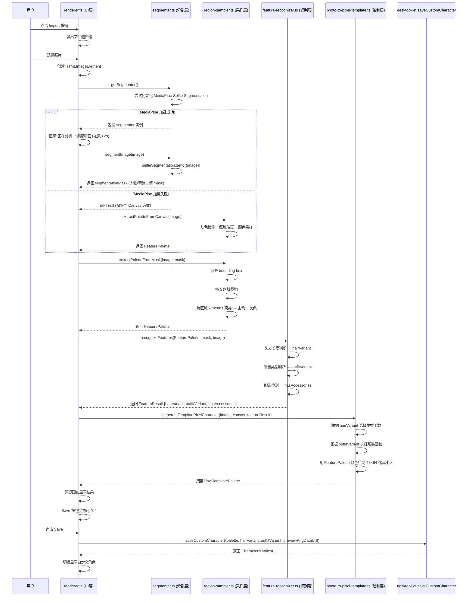

# M4 技术路线评估 — Photo-to-Pixel 人物分割模型选型

> 文档版本：v1 | 创建日期：2026-07-01 | 作者：架构师高见远
> 状态：已完成初步评估，待团队评审

---

## 推荐方案

### 首选方案：方案 B — MediaPipe Selfie Segmentation + 区域启发式采样

**推荐理由**：

1. **模型极轻量**：tflite 模型仅 464 KB，MediaPipe WASM runtime 约 2~3 MB，总增量预估 ~3 MB，远低于 5 MB 理想上限
2. **离线完全可行**：模型可打包在 Electron app 内，WASM 在 Chromium（Electron 底层）原生支持，无需首次网络下载
3. **专为 selfie/单人优化**：MobileNetV3 架构，在人物近景场景分割精度极高，完美适配桌宠应用的单人场景
4. **集成路径成熟**：`@tensorflow-models/body-segmentation` 已提供统一 API，同时支持 MediaPipe 和 BodyPix 两种 runtime，切换成本极低
5. **部位识别可通过启发式实现**：虽然 MediaPipe Selfie Segmentation 只做人物/背景二值分割（不做 24 部位分割），但结合 bounding box 5 区域采样 + 肤色检测 + 颜色聚类，完全可以实现 PM 文档中定义的特征提取需求

### 兜底方案：方案 C — 纯 Canvas 肤色检测 + 区域启发式采样

**兜底理由**：

1. **零依赖、零增量**：不引入任何 ML 模型，bundle size 完全不变
2. **永远可用**：不依赖 WASM/WebGL 初始化，不依赖模型加载，不存在加载失败的风险
3. **精度低但可接受**：对于 48×64 的极小输出，粗糙的人物轮廓足以完成区域采样（分割精度要求远低于全尺寸场景）
4. **降级策略**：当方案 B 的 WASM 加载失败或模型初始化超时时，自动切换到方案 C

---

## 4 种方案对比表格

| 评估维度 | 方案 A: BodyPix (TF.js) | 方案 B: MediaPipe Selfie Segmentation | 方案 C: 纯 Canvas 色彩检测 | 方案 D: ONNX Runtime + 轻量分割模型 |
|----------|------------------------|--------------------------------------|---------------------------|--------------------------------------|
| **Bundle 增量** | ~5-7 MB (tfjs runtime ~3.5MB + body-pix 模型 ~1.5MB) | ~3 MB (WASM ~2.5MB + 模型 464KB) | **0 MB** | ~4-6 MB (ONNX WASM ~3MB + 模型 1-2MB) |
| **Electron 兼容性** | ✓ 可在 renderer 运行，WebGL/CPU/WASM backend 均可用 | ✓ Chromium 原生支持 WASM，renderer 进程可运行 | ✓ 纯 Canvas API，无兼容性问题 | ✓ WASM backend 在 Electron renderer 可用，需配置 wasmPaths |
| **离线可行性** | ✓ 模型可打包在 app 内 | ✓ 模型 464KB 可直接打包 | ✓ 无模型依赖 | ✓ 模型需自选并打包，ONNX WASM 需本地托管 |
| **首次加载时间** | 3-8s (TF.js WASM 初始化 + 模型下载) | 1-3s (WASM 初始化 + 模型加载) | **<0.1s** (无初始化) | 2-5s (ONNX WASM 初始化 + 模型加载) |
| **分割精度(48×64)** | 高（精确到像素级） | **高**（专为 selfie 优化，对单人近景极准） | 低-中（肤色检测+边缘检测，复杂背景差） | 高（取决于选择的模型） |
| **部位识别能力** | ✓✓✓ 24 个身体部位（头/面/手臂/躯干/腿/脚） | ✗ 只做人物/背景二值分割，需启发式补充 | ✗ 无分割能力，需纯启发式 | ✗ 取决于选择的模型，一般分割模型只做二值 |
| **集成复杂度** | 中（需配置 TF.js backend，依赖较多） | **低**（body-segmentation 统一 API，开箱即用） | **极低**（纯 Canvas 代码，无外部依赖） | 高（需选模型、转换 ONNX、配置 runtime、调试兼容性） |
| **降级策略** | 降级到方案 C | 降级到方案 C | 无需降级（已是最低层） | 降级到方案 C |
| **维护风险** | ⚠️ BodyPix 已 deprecated，替换为 body-segmentation | ✓ MediaPipe 活跃维护，Google 官方支持 | ✓ 无外部依赖，零维护风险 | ⚠️ ONNX Runtime 活跃维护，但需自选自维护分割模型 |

---

## 方案 A：BodyPix（TensorFlow.js）详细分析

### 依赖包列表

| npm 包 | 预估大小 | 说明 |
|--------|---------|------|
| @tensorflow/tfjs | ~3.5 MB (minified) | TF.js 核心 runtime（含 WebGL/WASM/CPU backend） |
| @tensorflow-models/body-segmentation | ~200 KB | 统一分割 API（替代已废弃的 body-pix） |
| @tensorflow-models/body-pix 模型权重 | ~1.5 MB | MobileNetV1 × multiplier=0.75 模型 |

**总增量**：~5-7 MB（超出 5 MB 理想上限，在 10 MB 可接受范围内）

### ⚠️ 关键风险

- **BodyPix 已废弃**：`@tensorflow-models/body-pix` npm 包明确标注 "This package is deprecated in favor of the new body-segmentation package"。虽然 `body-segmentation` 仍支持 BodyPix 模型，但长期维护存在不确定性
- **TF.js 初始化慢**：在 Electron renderer 中首次加载 TF.js WASM backend 需要 3-8s，对用户体验影响较大
- **bundle size 大**：即使使用 size-optimized custom build（TF.js 官方提供 tfjs-custom-module CLI），推理专用最小包仍约 ~1.5-2 MB，加上模型权重总计仍 ~3.5-5 MB

### 部位识别能力

BodyPix 是 4 种方案中唯一原生支持 24 部位分割的方案。部位 ID 包括：
- 0-1: left/right face（面部）
- 12-13: torso front/back（躯干）
- 2-8: upper/lower leg（腿部）
- 14-20: upper/lower arm（手臂）
- 21-23: hands（手）
- 9-11: feet（脚）

理论上，24 部位分割可以精确提取头发区域（通过面部+头顶上方区域推断）、肤色（面部像素）、上衣色（躯干上半）、下装色（躯干下半+腿部）、鞋子色（脚部）。

### 集成方式

```typescript
// 在 renderer 进程中
import * as bodySegmentation from '@tensorflow-models/body-segmentation';

const model = bodySegmentation.SupportedModels.BodyPix;
const segmenter = await bodySegmentation.createSegmenter(model, {
  runtime: 'tfjs',  // 在 Electron 中使用 tfjs runtime
  architecture: 'MobileNetV1',
  outputStride: 16,
  multiplier: 0.75,
  quantBytes: 2
});

const segmentation = await segmenter.segmentPeople(imageElement, {
  multiSegmentation: false,
  segmentBodyParts: true  // 启用 24 部位分割
});
```

### 结论：不推荐作为首选

BodyPix 的部位分割能力是最强的，但 deprecated 状态、较大的 bundle size、慢初始化速度使其不适合作为首选方案。如果未来部位识别需求升级到精确像素级，可以考虑作为 P1/P2 增量升级。

---

## 方案 B：MediaPipe Selfie Segmentation 详细分析

### 依赖包列表

| npm 包 | 预估大小 | 说明 |
|--------|---------|------|
| @tensorflow-models/body-segmentation | ~200 KB | 统一分割 API（MediaPipe runtime 模式） |
| @mediapipe/selfie_segmentation | ~3 MB (含 WASM + 模型) | MediaPipe JS solution，含 WASM runtime 和 tflite 模型 |

**实际模型大小**：selfie_segmentation tflite 模型仅 **464 KB**（来自 HuggingFace qualcomm/MediaPipe-Selfie-Segmentation 仓库实测数据）

**总增量**：~3 MB（远低于 5 MB 理想上限）

### ⚠️ 注意：npm 包含 WASM runtime

`@mediapipe/selfie_segmentation` npm 包内嵌了 WASM runtime 文件和 tflite 模型文件。这些文件在 CDN 模式下通过网络加载（`locateFile` 回调指向 CDN），在 Electron 离线模式下需要配置为本地文件路径。

### Electron 兼容性

- Chromium 原生支持 WASM → Electron renderer 进程可直接运行
- 不需要 WebGL（MediaPipe selfie segmentation 使用 WASM backend）
- 不需要首次网络下载（模型可从 npm 包中直接引用本地文件）

### 集成方式（Electron 离线模式）

```typescript
// 方式 1：通过 body-segmentation 统一 API
import * as bodySegmentation from '@tensorflow-models/body-segmentation';

const model = bodySegmentation.SupportedModels.MediaPipeSelfieSegmentation;
const segmenter = await bodySegmentation.createSegmenter(model, {
  runtime: 'mediapipe',
  solutionPath: './node_modules/@mediapipe/selfie_segmentation',  // ← 本地路径，不走 CDN
  modelType: 'general'  // general 模型（256×256 输入）
});

const segmentation = await segmenter.segmentPeople(imageElement);

// 方式 2：直接使用 MediaPipe JS API（更轻量，不依赖 body-segmentation）
import { SelfieSegmentation } from '@mediapipe/selfie_segmentation';

const selfieSegmentation = new SelfieSegmentation({
  locateFile: (file) => {
    return `./assets/mediapipe/${file}`;  // ← 从打包的本地资源加载
  }
});

selfieSegmentation.setOptions({ modelSelection: 0 });  // 0 = general, 1 = landscape
selfieSegmentation.onResults((results) => {
  // results.segmentationMask → 人物/背景二值 mask
});

await selfieSegmentation.send({ image: imageElement });
```

### 推荐使用方式 2（直接 MediaPipe JS API）

**理由**：
- 不依赖 @tensorflow-models/body-segmentation（避免引入 TF.js 相关依赖链）
- 更轻量，只加载必要的 WASM runtime + 模型
- API 更简洁，适合 Electron 单人场景

### 部位识别能力：✗ 原生不支持，需启发式补充

MediaPipe Selfie Segmentation 只输出人物/背景二值 mask（`segmentationMask`），不区分身体部位。但这对 Project Seal 的实际需求影响可控：

**启发式部位识别方案**：

1. **获取人物 bounding box**：从二值 mask 中找到所有非零像素的 bounding box `(x_min, y_min, x_max, y_max)`
2. **按 Y 轴百分比划分 5 个区域**（PM 文档已定义）：
   - 头发区域：`y: 0%~25%`（bounding box 内）
   - 面部区域：`y: 25%~45%`
   - 上衣区域：`y: 45%~70%`
   - 下装区域：`y: 70%~85%`
   - 鞋子区域：`y: 85%~100%`
3. **在每个区域内做颜色聚类**（k-means 或频率排序），提取主色和次色
4. **头发长度判断**：计算头发区域内的非肤色像素占比和分布宽度
5. **肤色检测**：在面部区域内用 YCbCr 肤色范围 `(Cb: 77~127, Cr: 133~173)` 过滤像素，取主色作为肤色
6. **服装类型判断**：比较上衣区域和下装区域的主色差异度

这个启发式方案在 48×64 输出尺寸下完全足够。因为输出只有 3072 个像素，人物区域可能只有 ~1500-2000 个像素，5 区域各 ~300-400 个像素——颜色聚类在这个尺度下非常稳定。

### 分割精度评估

对于 48×64 像素输出，分割精度需求远低于全尺寸场景。具体论证：

- 最终输出只有 48×64 = 3072 像素
- 人物轮廓在该尺度下只需 ~8-10 个像素宽的边界精度即可
- MediaPipe general 模型输入 256×256，输出 256×256 mask，精度远超需求
- 可以先用 256×256 分割，再缩放到 48×64 用于区域分析——精度绰绰有余

### 首次加载时间预估

- WASM 初始化：~500-1000ms
- 模型加载（464 KB 本地文件）：~100-200ms
- 首次推理预热：~200-400ms
- **总计**：~1-2s（在 Electron renderer 中，本地加载）

远低于 PM 要求的 <5s 加载时间。如果 >2s，显示进度动画即可。

### 降级策略

```
尝试加载 MediaPipe Selfie Segmentation
  ├─ 成功 → 使用方案 B（分割 + 启发式采样）
  ├─ WASM 初始化失败 → 降级到方案 C（纯 Canvas 肤色检测）
  ├─ 模型加载超时 (>5s) → 降级到方案 C
  └─ 分割结果置信度低 → 降级到方案 C 的区域采样
```

### 结论：推荐作为首选方案 ✓✓✓

---

## 方案 C：纯 Canvas 肤色检测（无 ML 模型）详细分析

### 依赖包列表

| npm 包 | 大小 | 说明 |
|--------|------|------|
| **无外部依赖** | **0 KB** | 纯 Canvas API + 数学运算 |

**总增量**：**0 MB**

### 核心算法设计

#### 步骤 1：肤色检测（YCbCr 阈值法）

```typescript
function detectSkinPixels(imageData: ImageData): Uint8Array {
  const mask = new Uint8Array(imageData.width * imageData.height);
  for (let i = 0; i < imageData.data.length; i += 4) {
    const r = imageData.data[i];
    const g = imageData.data[i + 1];
    const b = imageData.data[i + 2];
    // YCbCr 转换
    const y  = 0.299 * r + 0.587 * g + 0.114 * b;
    const cb = 128 - 0.168736 * r - 0.331264 * g + 0.5 * b;
    const cr = 128 + 0.5 * r - 0.418688 * g - 0.081312 * b;
    // 肤色范围（适用于多肤色）
    mask[i / 4] = (cb >= 77 && cb <= 127 && cr >= 133 && cr <= 173) ? 1 : 0;
  }
  return mask;
}
```

#### 步骤 2：人物区域定位

- 找到肤色像素的 bounding box → 大致定位面部+暴露皮肤区域
- 扩展 bounding box 向下延伸（假设身体在面部下方）→ 估算整个人物区域

#### 步骤 3：5 区域颜色采样

- 沿估算的人物 bounding box，按 Y 轴百分比划分 5 个区域
- 每个区域内做颜色聚类（频率排序 + top-2 颜色提取）

#### 步骤 4：头发区域推断

- 面部区域上方的非肤色像素 → 推断为头发
- 计算头发区域的宽度和高度占比 → 判断发型

### 精度评估

| 场景 | 预期效果 | 问题描述 |
|------|---------|---------|
| 纯色背景 + 单人正面照 | ✓ 效果较好 | 肤色检测 + 区域采样可以工作 |
| 复杂背景（家具/植物/多人） | ✗ 效果差 | 肤色检测可能误检背景中的肤色物体 |
| 侧脸/俯视/仰视 | ✗ 效果差 | bounding box 推算不准，区域划分偏差大 |
| 穿着暴露皮肤的服装 | ⚠️ 部分可用 | 肤色检测可能把裸露皮肤误归类 |

### 关键优势

1. **零等待时间**：无模型加载，处理立即开始
2. **永远可用**：不依赖 WASM/WebGL 初始化，不存在加载失败
3. **极简集成**：纯 TypeScript 代码，无外部依赖链

### 关键劣势

1. **复杂背景误检**：背景中的肤色物体（木质、食品等）会被误识别为皮肤
2. **非正面照片不准**：bounding box 推算依赖正面照假设
3. **无法真正去背**：只能做粗略的人物区域定位，不能精确分割人物轮廓

### 结论：推荐作为兜底方案 ✓✓

方案 C 精度低，但在 48×64 的极小输出下，"粗略的人物区域定位 + 区域颜色采样"仍然可以产出比旧流程（全图平均色）明显更好的结果。作为兜底方案，确保即使 ML 模型完全不可用，用户仍能得到"比平均色好"的体验。

---

## 方案 D：ONNX Runtime + 轻量分割模型详细分析

### 依赖包列表

| npm 包 | 预估大小 | 说明 |
|--------|---------|------|
| onnxruntime-web | ~3 MB (WASM runtime) | ONNX WASM runtime，含 ort-wasm-simd-threaded.wasm |
| 自选分割模型 (ONNX) | ~1-2 MB | 需自行选择和转换模型 |

**总增量**：~4-6 MB

### 可选分割模型

| 模型 | 大小 | 特点 |
|------|------|------|
| MobileNetV3-Seg (ONNX) | ~1-2 MB | 通用分割模型，需自行转换 |
| U²-Net tiny (ONNX) | ~4 MB | 专用人像分割，精度高但体积大 |
 | IS-Net (ONNX) | ~2-3 MB | 轻量人像分割模型 |
| SelfieSegmentation → ONNX | ~0.5 MB | MediaPipe 模型转 ONNX（需自己转换） |

### 集成方式

```typescript
import * as ort from 'onnxruntime-web';

// 配置 WASM 文件路径（Electron 离线模式）
ort.env.wasm.wasmPaths = './assets/onnxruntime/';

const session = await ort.InferenceSession.create('./assets/segmentation-model.onnx');

// 推理...
const results = await session.run({ input: inputTensor });
```

### 关键风险

1. **需自选自维护模型**：没有现成的 npm 包提供"开箱即用"的分割模型，需要自己从 PyTorch/TensorFlow 转换为 ONNX 格式
2. **模型转换复杂**：需要 Python 环境 + onnxruntime-tools 或 🤗 Optimum 进行模型转换
3. **WASM 文件需手动托管**：onnxruntime-web 的 WASM 文件不会自动打包进 Vite bundle，需要手动配置 wasmPaths
4. **集成调试成本高**：相比方案 B 的 npm install + 3 行代码调用，方案 D 需要大量配置和调试
5. **部位识别同样不支持**：和方案 B 一样，一般分割模型只做二值分割，需启发式补充

### 与方案 B 的对比

方案 D 和方案 B 在功能上等价（都只做人物/背景分割，都需启发式补充部位识别），但方案 D 的集成成本显著更高，且没有现成的分割模型可用。唯一优势是模型可自定义（如果未来需要特殊模型），但这在 MVP 阶段没有价值。

### 结论：不推荐

方案 D 的集成复杂度远高于方案 B，而功能和精度并不更好。在 MVP 阶段，自定义模型的需求不存在，方案 B 的现成方案更实用。如果未来需要运行非 MediaPipe 提供的特殊模型（如多人分割、场景分割等），可以考虑升级到方案 D。

---

## 部位识别的替代方案：区域启发式采样

无论选择方案 B（MediaPipe）还是方案 C（纯 Canvas），部位识别都需要通过启发式方法实现。以下是完整的替代方案设计。

### 方案 1：bounding box 5 区域采样（不需要部位分割）

这是 PM 文档中已定义的核心方案，对任何分割方案都适用：

```
人物 bounding box (从分割 mask 获取)
  ┌───────────────────┐ y_min
  │   头发区域         │ ← y: y_min ~ y_min + 25%×height
  ├───────────────────┤
  │   面部区域         │ ← y: y_min + 25%×height ~ y_min + 45%×height
  ├───────────────────┤
  │   上衣区域         │ ← y: y_min + 45%×height ~ y_min + 70%×height
  ├───────────────────┤
  │   下装区域         │ ← y: y_min + 70%×height ~ y_min + 85%×height
  ├───────────────────┤
  │   鞋子区域         │ ← y: y_min + 85%×height ~ y_max
  └───────────────────┘ y_max
```

**每个区域的处理**：
1. 只取 mask 内的像素（人物像素，排除背景）
2. 做 k-means 聚类（k=2）或频率排序取 top-2 颜色
3. 主色 → palette 对应字段
4. 次色 → accent/shadow 等装饰字段

### 方案 2：肤色检测 + 颜色聚类近似部位识别

在面部区域和头发区域，额外使用肤色检测来精确区分：

```
面部区域 (y: 25%~45%)
  → YCbCr 肤色过滤 → 肤色像素集合 → 主色 = palette.skin
  → 非肤色像素（极少）→ 排除

头发区域 (y: 0%~25%)
  → YCbCr 肤色过滤 → 肤色像素 = 需排除的面部上方皮肤
  → 非肤色像素 → 主色 = palette.hair
  → 非肤色像素的分布宽度 → 判断发型类型
    ├─ 宽度 ≤ 50% bbox → hairShort()
    ├─ 宽度 50%~70% → hairBob()
    ├─ 宽度 ≥ 70% → hairCurly() 或 hairLong()
    └─ 高度占比 ≤ 20% → hairShort()
    └─ 高度占比 ≥ 35% → hairLong()
```

### 方案 3：服装类型判断

```
上衣主色 vs 下装主色
  ├─ 色差 < 阈值（同色系）→ 连衣裙/一体裙装 → simple_dress
  ├─ 色差 > 阈值（不同色）→ 分体装
  │   ├─ 下装面积小 → shorts_casual
  │   ├─ 下装面积大 + 上衣宽松 → hoodie_casual
  │   └─ 下装面积大 + 上衣合身 → approved_base / soft_uniform
  └─ 无法判断 → approved_base (默认兜底)
```

### 简易 k-means 颜色聚类实现

```typescript
function regionDominantColors(
  imageData: ImageData,
  mask: Uint8Array,
  regionYStart: number,
  regionYEnd: number,
  k: number = 2
): { primary: Rgb; secondary: Rgb } {
  // 1. 收集区域内 mask=1 的像素
  const pixels: Rgb[] = [];
  for (let y = regionYStart; y < regionYEnd; y++) {
    for (let x = 0; x < imageData.width; x++) {
      const idx = y * imageData.width + x;
      if (mask[idx] === 1) {
        const offset = idx * 4;
        pixels.push({
          red: imageData.data[offset],
          green: imageData.data[offset + 1],
          blue: imageData.data[offset + 2]
        });
      }
    }
  }

  // 2. 简易 k-means (3 次迭代即可，48×64 像素数据量极小)
  // ... 或更简单的频率排序：量化到 24 步进后按频率排序

  // 3. 返回 top-2 颜色
}
```

---

## 模型加载策略

### 首选：Lazy Load（首次 Import 时加载）

```typescript
// src/renderer/segmentation/lazy-segmenter.ts

let segmenterInstance: SelfieSegmentation | null = null;
let isLoadAttempted = false;
let loadStartTime = 0;

export async function getSegmenter(): Promise<SelfieSegmentation | null> {
  if (segmenterInstance) return segmenterInstance;
  if (isLoadAttempted) return null;  // 已尝试过，失败则不再重试

  isLoadAttempted = true;
  loadStartTime = performance.now();

  try {
    segmenterInstance = new SelfieSegmentation({
      locateFile: (file: string) => {
        return `./assets/mediapipe/${file}`;
      }
    });
    segmenterInstance.setOptions({ modelSelection: 0 });
    await segmenterInstance.initialize();  // WASM + 模型加载
    return segmenterInstance;
  } catch (error) {
    console.warn('MediaPipe Selfie Segmentation 加载失败，降级到纯 Canvas 方案', error);
    segmenterInstance = null;
    return null;
  }
}
```

### 缓存：模型加载后缓存到 Electron userData 目录

MediaPipe WASM runtime 和 tflite 模型文件打包在 `assets/mediapipe/` 目录下，随 app 安装一起分发。首次加载从本地文件读取（不走 CDN），后续加载直接从内存缓存（`segmenterInstance` 保持引用）。

**不需要额外的磁盘缓存机制**：因为模型文件本身就是打包在 app 内的本地文件，每次 Import 直接从本地读取，不存在"首次下载后缓存"的需求。

### 进度提示

```typescript
// 在 renderer.ts 中
const loadingIndicator = document.querySelector<HTMLDivElement>('#loading-indicator');

async function handleImageImport(image: HTMLImageElement): Promise<void> {
  const segmenter = await getSegmenter();

  if (segmenter) {
    // 方案 B：使用分割模型
    if (performance.now() - loadStartTime > 2000) {
      loadingIndicator.textContent = '正在分析照片特征...';
      loadingIndicator.style.display = 'block';
    }
    const mask = await segmentImage(segmenter, image);
    loadingIndicator.style.display = 'none';
    const palette = extractPaletteFromMask(image, mask);
    const variantId = selectVariantFromPalette(palette);
    generateTemplatePixelCharacter(image, previewCanvas, variantId, palette);
  } else {
    // 方案 C：降级到纯 Canvas
    const palette = extractPaletteFromCanvas(image);
    const variantId = selectVariantFromPalette(palette);
    generateTemplatePixelCharacter(image, previewCanvas, variantId, palette);
  }
}
```

---

## 与现有代码的集成方案

### 新增文件列表

| 相对路径 | 说明 |
|----------|------|
| `src/renderer/segmentation/segmenter.ts` | 分割器核心模块（MediaPipe 初始化 + 推理 + 降级逻辑） |
| `src/renderer/segmentation/region-sampler.ts` | 区域颜色采样（5 区域 + k-means 聚类 + 肤色检测） |
| `src/renderer/segmentation/feature-recognizer.ts` | 特征识别（发型判断 + 服装类型判断 + 配饰检测） |
| `src/renderer/segmentation/canvas-fallback.ts` | 纯 Canvas 降级方案（肤色检测 + 简易分割 + 区域采样） |
| `src/renderer/segmentation/types.ts` | 分割/采样/识别的类型定义 |
| `assets/mediapipe/selfie_segmentation_solution_packed_assets_loader.js` | MediaPipe WASM loader（从 npm 包复制） |
| `assets/mediapipe/selfie_segmentation_solution_packed_assets.data` | MediaPipe 模型数据文件（从 npm 包复制） |
| `assets/mediapipe/selfie_segmentation_solution_simd_wasm_js.wasm` | MediaPipe WASM runtime（从 npm 包复制） |

### 修改文件列表

| 相对路径 | 修改内容 |
|----------|---------|
| `src/renderer/photo-to-pixel-template.ts` | 1. 新增发型函数 `hairShort()` / `hairLong()` / `hairCurly()` 2. `paletteFromImage()` → 接收 `FeaturePalette` 而非全图平均色 3. `head()` 肤色不再硬编码 `#ffe6d2`，改为 `palette.skin` 4. 新增服装/发型选择逻辑 5. `generateTemplatePixelCharacter()` 入口增加 `featurePalette` 参数 |
| `src/renderer/renderer.ts` | 1. Import 流程改为调用 segmentation 模块 2. 新增 `loading-indicator` DOM 元素 3. `useApprovedBaselinePreview()` 改为调用特征识别流程 4. `saveCustomCharacter` payload 增加 `hairVariant` / `outfitVariant` 字段 |
| `package.json` | 新增依赖：`@mediapipe/selfie_segmentation` |
| `electron.vite.config.ts` | 配置 `assets/mediapipe/` 为静态资源目录（不参与 Vite bundle，直接复制到 dist） |

### 数据流图



### 依赖包列表

```
- @mediapipe/selfie_segmentation@0.1.1675465747: MediaPipe 自拍分割 JS solution（含 WASM runtime + tflite 模型）
  - 预估增量: ~3 MB
  - 用途: 人物/背景分割
  - 离线模式: 通过 locateFile 配置本地路径
```

---

## 待明确事项

| # | 问题 | 影响范围 | 建议 |
|---|------|---------|------|
| 1 | `@mediapipe/selfie_segmentation` npm 包在 Electron + Vite 构建中的 WASM 文件打包方案 | 构建配置 | 需在 `electron.vite.config.ts` 中配置 WASM/data 文件为静态资源，不参与 JS bundle。可能需要复制到 `dist/renderer/assets/mediapipe/` 目录 |
| 2 | MediaPipe selfie segmentation 的 `initialize()` 方法是否需要显式调用 | 集成代码 | 需实测确认初始化流程。部分版本的 MediaPipe JS solution 在首次 `send()` 时自动初始化 |
| 3 | 方案 B 的 WASM 文件是否需要 SIMD 支持 | Electron 兼容性 | Electron 33+ 的 Chromium 支持 WASM SIMD，应该没问题。但如果用户 Electron 版本较低，可能需要 fallback |
| 4 | 5 区域 Y 轴百分比的阈值在不同照片角度下的可靠性 | 特征识别 | MVP 阶段先假设正面照，阈值在实机测试中微调。非正面照降级到默认模板 |
| 5 | 发型判断阈值（头发区域高度占比 20%/35%）在分割 mask 下的实际表现 | 特征识别 | 需实测 5-10 张不同发型照片后微调阈值 |
| 6 | 纯 Canvas 降级方案在"背景含肤色物体"时的误检率 | 降级策略 | 可以增加简单的前置检测：如果肤色像素占比 >60%，判定为非典型人物照，降级到旧流程 |
| 7 | `@tensorflow-models/body-segmentation` 是否作为方案 B 的必要依赖 | 依赖选择 | 推荐不依赖 body-segmentation，直接使用 `@mediapipe/selfie_segmentation` 的原生 JS API，避免引入 TF.js 依赖链 |
| 8 | 现有 `CharacterManifest` 类型是否需要扩展字段（hairVariant/outfitVariant） | 类型定义 | 需要扩展。当前 `palette` 字段可保留，新增 `hairVariant` 和 `outfitVariant` 字段 |

---

## 附录：关键数据来源

| 数据 | 来源 | 说明 |
|------|------|------|
| MediaPipe selfie segmentation tflite 模型大小 = 464 KB | HuggingFace qualcomm/MediaPipe-Selfie-Segmentation | Xet Pointer 显示 "Size of remote file: 464 kB" |
| BodyPix 已 deprecated | npmjs.com @tensorflow-models/body-pix | "Note: This package is deprecated in favor of the new body-segmentation package" |
| body-segmentation 统一 API 支持 MediaPipe + BodyPix | GitHub tensorflow/tfjs-models/body-segmentation | 两种 runtime 可切换 |
| MediaPipe general 模型输入 256×256, landscape 144×256 | GitHub mediapipe selfie_segmentation.md | 官方文档 |
| ONNX Runtime Web WASM 文件列表 | onnxruntime.ai/docs/tutorials/web/deploy.html | 3 个 WASM 文件，条件导入可减少 |
| TF.js size-optimized bundle 方案 | tensorflow.org/js/tutorials/deployment/size_optimized_bundles | 可通过 custom module 减小到 ~1.5-2 MB |
